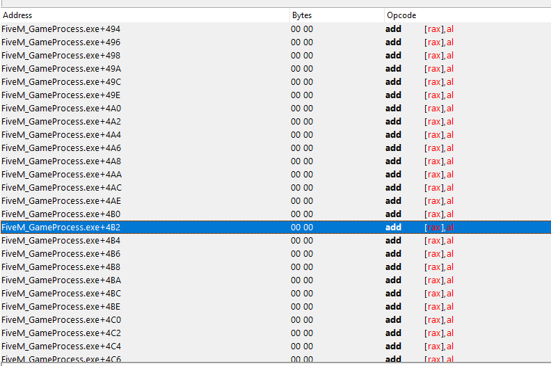
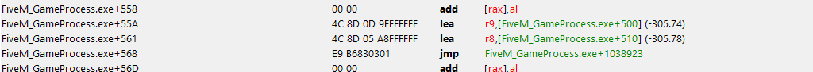
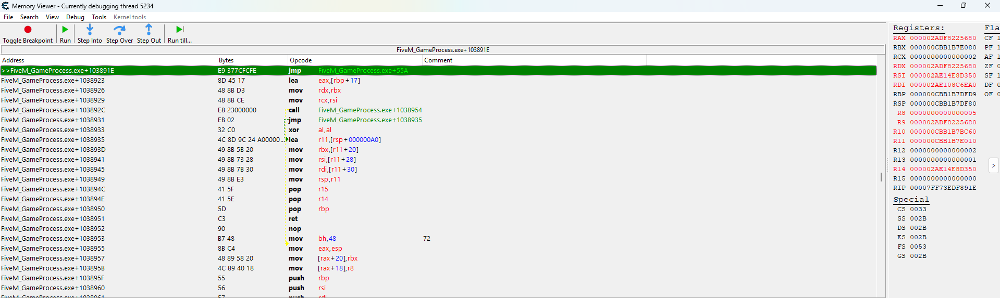
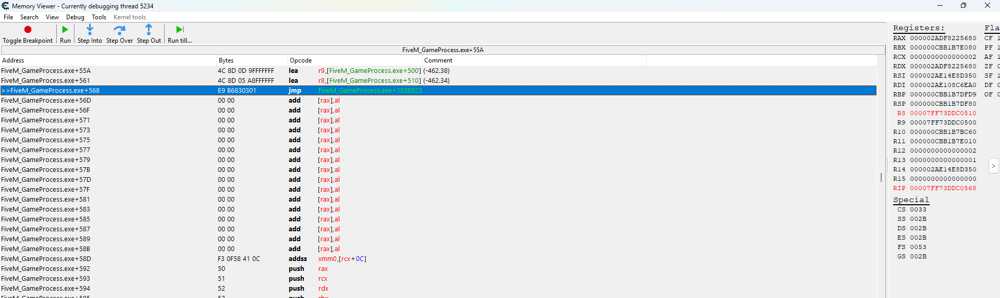
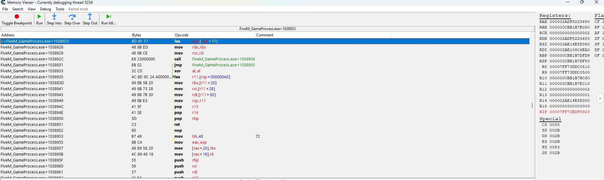

# Magic Bullet - Writeup

## Proof of concept


---

## What this writeup will NOT cover

Things like reading and writing process memory, iterating over game entities,
retrieving bone positions, setting up a cheat loop, or rendering overlays will
not be covered here — there are plenty of resources on those topics already.

## What this writeup WILL cover

- Reverse engineering the bullet direction system
- Finding and using a code cave
- Writing and mapping shellcode from an external process
- Patching the target function at runtime
- Redirecting bullet origin and destination to arbitrary positions
- Detection methods and server-side validation

---

## 1. Reverse Engineering the bullet system

First, lets take a look at the function responsible for calculating the bullet direction:

### Original function

```cpp
__int64 __fastcall sub_101A5F4(__int64 a1, __int64 a2, float *a3, float *a4, float a5, int a6, char a7, char a8)
{
  float v10; // xmm3_4
  float v11; // xmm2_4
  double v12; // xmm0_8
  float v13; // xmm1_4
  int v15; // [rsp+2Ch] [rbp-Ch]

  *(float *)a1 = *a3;
  *(float *)(a1 + 4) = a3[1];
  *(float *)(a1 + 8) = a3[2];
  *(float *)(a1 + 12) = a3[3];
  *(float *)(a1 + 16) = *a3;
  *(float *)(a1 + 20) = a3[1];
  *(float *)(a1 + 24) = a3[2];
  *(float *)(a1 + 28) = a3[3];
  *(_BYTE *)(a1 + 56) &= 0xF8u;
  *(_DWORD *)(a1 + 52) = a6;
  *(_BYTE *)(a1 + 56) |= 2 * (a7 & 1 | (2 * (a8 & 1)));
  v10 = *a4 - *a3;
  v11 = a4[2] - a3[2];
  *(float *)(a1 + 36) = a4[1] - a3[1];
  *(float *)(a1 + 32) = v10;
  *(float *)(a1 + 40) = v11;
  *(_DWORD *)(a1 + 44) = v15;
  v12 = sub_1324DC8();
  *(float *)(a1 + 32) = (float)(*(float *)&v12 * *(float *)(a1 + 32)) * a5;
  v13 = *(float *)&v12 * *(float *)(a1 + 36);
  *(float *)(a1 + 40) = (float)(*(float *)&v12 * *(float *)(a1 + 40)) * a5;
  *(float *)(a1 + 36) = v13 * a5;
  *(_DWORD *)(a1 + 48) = *(_DWORD *)(a2 + 272);
  return a1;
}
```

### My interpretation

```cpp
struct Bullet_Direction
{
    _vec3   pos_origin;
    float   pos_origin_x;
    _vec3   pos_current;
    float   pos_current_x;
    _vec3   velocity;
    int     unk;
    int     unk1;
    int     param_a6;
    uint8_t flags;
};

Bullet_Direction *__fastcall fn_Calculate_Bullet_Direction(
        Bullet_Direction *direction_out,
        __int64 a2,
        PVec3 start_pos,
        PVec3 end_pos,
        float speed,
        int a6,
        char a7,
        char a8)
{
  float direction_pos_y; // xmm0_4
  float direction_pos_x; // xmm3_4
  float direction_pos_z; // xmm2_4
  float inv_len; // xmm0_4
  float v14; // xmm1_4
  int v16; // [rsp+2Ch] [rbp-Ch]

  direction_out->pos_origin = *start_pos;
  direction_out->pos_origin_x = start_pos[1].x;
  direction_out->pos_current = *start_pos;
  direction_out->pos_current_x = start_pos[1].x;
  direction_out->flags &= 0xF8u;
  direction_out->param_a6 = a6;
  direction_out->flags |= 2 * (a7 & 1 | (2 * (a8 & 1)));
  direction_pos_y = end_pos->y - start_pos->y;
  direction_pos_x = end_pos->x - start_pos->x;
  direction_pos_z = end_pos->z - start_pos->z;
  direction_out->velocity.y = direction_pos_y;
  direction_out->velocity.x = direction_pos_x;
  direction_out->velocity.z = direction_pos_z;
  direction_out->unk_2C = v16;
  inv_len = rsqrt(
              (float)((float)(direction_pos_y * direction_pos_y) + (float)(direction_pos_x * direction_pos_x))
            + (float)(direction_pos_z * direction_pos_z));
  direction_out->velocity.x = (float)(inv_len * direction_out->velocity.x) * speed;
  v14 = inv_len * direction_out->velocity.y;
  direction_out->velocity.z = (float)(inv_len * direction_out->velocity.z) * speed;
  direction_out->velocity.y = v14 * speed;
  direction_out->unknown = *(_DWORD *)(a2 + 0x110);
  return direction_out;
}
```

This function takes a start_pos and end_pos and computes a normalized velocity vector scaled by speed. The pos_origin and pos_current fields are both initialized to start_pos — origin stays fixed as a reference while current gets updated each physics tick.
The direction vector is computed as the difference between end_pos and start_pos. Normalization is done via rsqrt (reciprocal square root of the squared magnitude), which is then multiplied directly into each velocity component alongside speed. The intermediate v14 is just a temporary register holding the scaled Y velocity before the final speed multiply.

Now lets look at how this function is called:
```cpp
bullet_direction = fn_Calculate_Bullet_Direction(
    v28, *(_QWORD *)(a1 + 56), start_pos, end_pos, speed, a9, a10, a15);
```

The `start_pos` and `end_pos` are already calculated before reaching this point, and since we are not hooking at the first byte of the function
we need to trace back further. Looking at cross-references to `fn_Calculate_Bullet_Direction`
we find the actual caller:
```cpp
bullet_origin  = bullet_origin_calc;
waepon_handler = *(_QWORD *)(Weapon_handler_ptr + 0x40);
weapon_type    = *(_DWORD *)(waepon_handler + 0x54);

if (weapon_type >= 2) {
    if (weapon_type <= 3)   // Normal weapons
        return normal_weapon_shoot_wrapper(
            Weapon_handler_ptr, (PVec3)camera_information,
            (PVec3)&start_pos, (__int32 *)&endpos);

    if (weapon_type == 4)   // Throwables and rockets
         // Challenge: this function behaves differently from the standard weapon shoot routine.
         // The method used for normal weapons will not work for rockets. Reverse this function
         // and implement your own way to hijack or override the shoot vectors.
         return throwable_weapon_shoot_wrapper(
             (__m128 *)Weapon_handler_ptr, (__int64)camera_information,
             (PVec3)&start_pos, (PVec3)&endpos);
}
       
```

In assembly, right before the call:
```asm
lea     r9, [rbp+57h+endpos]
lea     r8, [rbp+57h+start_pos]
mov     rdx, rbx
mov     rcx, rsi
call    normal_weapon_shoot_wrapper
```

`R9` holds `end_pos` and `R8` holds `start_pos`. These are the values we want
to hijack. Since we are external we cannot simply hook `normal_weapon_shoot_wrapper`
or `throwable_weapon_shoot_wrapper` and modify the arguments at runtime.

Instead, we will manipulate the game byte by byte using a **code cave**.

---

## 2. The code cave approach

You might think the natural solution is to allocate virtual memory in the process
and execute our shellcode there. However, this approach has drawbacks.

Jumping to externally allocated memory requires larger patches and results in
execution flow leaving the game's module entirely, which is generally less ideal
from a stealth perspective.

This is where code caves come in. A **code cave** is a region of memory inside
the game's own module that is completely empty (filled with null bytes) and already
has execution permissions. Here is an example of how one looks in a debugger:



There are many ways to find a code cave — you can browse the module manually in a
debugger, or write an algorithm that iterates over the module looking for a run of
null bytes and returns the offset and size of the region.

Because the shellcode resides inside the game module itself, the jump simply
targets another legitimate region of the module, making the control flow appear
more natural.

---

## 3. Mapping the shellcode

We will use three separate regions within the module; the offsets used here may differ depending on the game build.

| Offset | Purpose |
|--------|---------|
| `modulebase + 0x500` | Buffer for **end_pos** (target bone Vector3) |
| `modulebase + 0x510` | Buffer for **start_pos** (origin/feet Vector3) |
| `modulebase + 0x55A` | The actual **shellcode** (code cave) |

### Writing the position buffers

Every frame we write our desired Vector3 values into the two buffers:
```cpp
// gamePos = target bone we want the bullet to hit
memory::write<Vector>((ULONGLONG)memory::getModule() + 0x500, gamePos);

// origin = feet position of the target player
memory::write<Vector>((ULONGLONG)memory::getModule() + 0x510, origin);
```

The bullet will **spawn inside the targeted bone** and travel towards the feet
of the target, guaranteeing that the first contact is exactly the bone we aimed at.

### Building the shellcode

The shellcode is written once at `modulebase + 0x55A`. Since it sits at that fixed
offset, the RIP-relative operands of both `lea` instructions resolve to exactly
our two buffers:
```cpp
std::vector<uint8_t> magicBulletFunc{
    0x4C, 0x8D, 0x0D, 0x9F, 0xFF, 0xFF, 0xFF,  // lea r9, [rip-0x61] → resolves to modulebase+0x500 (RIP = modulebase+0x55A + instruction length (7))
    0x4C, 0x8D, 0x05, 0xA8, 0xFF, 0xFF, 0xFF,  // lea r8, [rip-0x58] → resolves to modulebase+0x510 (RIP = modulebase+0x561 + instruction length (7))
    0xE9                                        // jmp rel32 (back to original function)
};
```

This redirects R9 and R8 to our custom buffers — but if we try to execute it now
we will crash, since the `jmp` back to the original function is not filled yet.

### Calculating the return address

First we need the offset of the bytes we are going to patch:
```asm
0x103891E   4C 8D 4D 07   lea r9, [rbp+57h+end_pos]
0x1038922   4C 8D 45 17   lea r8, [rbp+57h+start_pos]
```

Our patch offset is `0x103891E`. However if we jump back to that exact address
we will get an **infinite loop** — the shellcode would keep redirecting execution
back into itself. Instead we jump to `0x103891E + 0x5`, skipping over the 5
bytes of the `jmp` we patched.

Now we calculate the relative offset and append it to the vector:
```cpp
uintptr_t patch_addr    = memory::getModule() + 0x103891E;
uintptr_t jmp_back      = patch_addr + 0x5;
uintptr_t shellcode_end = memory::getModule() + 0x55A + magicBulletFunc.size();

int32_t relative_address = (int32_t)(jmp_back - shellcode_end);

magicBulletFunc.push_back((relative_address >> 0)  & 0xFF);
magicBulletFunc.push_back((relative_address >> 8)  & 0xFF);
magicBulletFunc.push_back((relative_address >> 16) & 0xFF);
magicBulletFunc.push_back((relative_address >> 24) & 0xFF);
```

The vector is now **15 bytes** total and ready to be written to `modulebase + 0x55A`.

We can verify the shellcode was written correctly by inspecting the memory region
in a debugger — the bytes should match our vector exactly:



We can also verify the jump destination by inspecting the target memory region,
confirming it lands exactly where expected:


---

## 4. Patching the target function

Now that the shellcode is mapped we need to redirect the original function to it.
The key idea is to apply the patch **only when needed** — i.e. when we have a
valid target — to avoid crashes during normal gameplay.

First we build the `jmp` that will redirect execution to our shellcode, and save
the original bytes before touching anything:
```cpp
auto writeOffset  = memory::getModule() + 0x103891E;  // bytes we will patch
auto myFuncOffset = memory::getModule() + 0x55A;      // our shellcode
auto caller       = memory::getModule() + 0x103891E + 0x5;  // return address

std::vector<uint8_t> jmp_to_shellcode = { 0xE9 };
int32_t relative_address = (int32_t)(myFuncOffset - (writeOffset + 5));
jmp_to_shellcode.push_back((relative_address >> 0)  & 0xFF);
jmp_to_shellcode.push_back((relative_address >> 8)  & 0xFF);
jmp_to_shellcode.push_back((relative_address >> 16) & 0xFF);
jmp_to_shellcode.push_back((relative_address >> 24) & 0xFF);

// save original bytes before patching so we can restore them later
std::vector<uint8_t> original_bytes(5);
ReadProcessMemory(hProcess, (LPVOID)writeOffset, original_bytes.data(), 5, 0);
```

Then in our main loop, we only activate the patch when we have a valid target,
and write the position buffers every frame so the bullet always hits the right bone:
```cpp
if (globals::cSettings::getB(globals::bSettings::mBullet)) {
    memory::write<Vector>((ULONGLONG)memory::getModule() + 0x500, gamePos);
    memory::write<Vector>((ULONGLONG)memory::getModule() + 0x510, origin);

    if (!isPatched) {
        WriteProcessMemory(hProcess, (LPVOID)writeOffset, jmp_to_shellcode.data(), jmp_to_shellcode.size(), 0);
        isPatched = true;
    }
}
```

> Restoring the original bytes is left as an exercise — if you understood the
> previous steps it should be straightforward to implement.

With the patch active, our shellcode runs every time the player fires. We can
confirm this by setting a breakpoint and observing the game's state at each stage
of execution.

Here we can see the registers **before** our shellcode runs — R8 and R9 still
point to the original stack positions:



Execution is redirected to our code cave:



And after our shellcode completes, R8 and R9 now point to our custom buffers
at `modulebase + 0x500` and `modulebase + 0x510`, with the target position
values we wrote:



---

## 5. Detection Methods

Now that we understand how the technique works, lets look at how it can be detected
from the anti-cheat side. The code accompanying this writeup implements several of
these approaches.

### 5.1 — .text Section Hash Monitoring

The most straightforward detection is periodically hashing the game's `.text`
section and comparing it against a known-good baseline captured at startup.

```cpp
// Capture baseline at startup
auto original_hash = generate_SHA256(section_memory_chunk);

// Poll every second
while (true) {
    read_buffer(moduleBase, data.data(), module_size);
    auto new_hash = generate_SHA256(new_section_memory_chunk);
    if (original_hash != new_hash)
        printf("[!] Modification in the .text section detected\n");
    Sleep(1000);
}
```

Our patch writes 5 bytes to `0x103891E` inside `.text`. A hash mismatch fires
the moment those bytes differ from the baseline. The weakness of this approach
is granularity — a full section hash tells you *something* changed, but not *where*.
Combining it with per-region hashing narrows it down.

### 5.2 — Code Cave Hash Monitoring

A complementary approach is to track the null-byte regions (code caves) separately.
We scan the module at startup, record every cave that is at least 100 bytes, hash
each one, and then re-hash them on every iteration.

```cpp
auto original_caves            = find_codecave(data.data(), module_size);
auto original_code_cave_hashes = generate_caves_hashes(original_caves);
```

Because our shellcode lives in one of those caves, writing it causes a hash
mismatch for that specific region — even if the rest of `.text` were somehow
left untouched. This gives a much more targeted signal:

```
"[!] Code cave content was modified — possible shellcode injection!\n"
```

The attacker cannot avoid this: by definition, the code cave technique requires
writing non-zero bytes into a previously null region.

### 5.3 — Module Integrity via PE Header Parsing
Before analyzing caves or hashing sections we first parse the PE headers to locate the exact boundaries of each section:
```cpp
auto nt_headers     = get_headers(data.data());
auto target_section = get_section_by_name(nt_headers, ".text");
```
This means the tool is not guessing at offsets — it reads `VirtualAddress` and `SizeOfRawData` directly from the `IMAGE_SECTION_HEADER`, so it stays correct even across game updates that shift code around. Any tool that skips this step and hardcodes offsets will silently miss modifications after a patch.

### 5.4 — Snapshot-Based Comparison
Rather than storing only a single baseline hash, a more robust design takes a full memory snapshot of the module at a trusted point in time (ideally before any third-party code has had a chance to run) and compares it byte-by-byte on demand. This lets you report the exact offset of the first differing byte, which is useful for forensics and for identifying *which* patch was applied.

### 5.5 — What these detections catch and what they miss
| Detection | Catches our technique | Limitation |
|---|---|---|
| `.text` hash | Yes — 5 patched bytes change the hash | Hash only; no location info |
| Code cave hash | Yes — shellcode fills null region | Requires cave analysis to be correct |
| PE-based section scan | Yes — locates exact modified section | Needs to run before attacker patches |
| Byte-by-byte snapshot | Yes — pinpoints exact offset | Memory cost; needs trusted baseline |

No client-side detection is foolproof. A sufficiently motivated attacker can patch the detection code itself, run before the tool initializes, or restore original bytes between polling intervals. This is why **server-side validation is essential** and discussed in the next section.

---

## 6. Why Server-Side Bullet Validation Matters

All of the detections above are **client-side**. The fundamental problem with
client-side anti-cheat is that the attacker controls the machine the code runs on.
Any check that executes on the client can, in principle, be bypassed by an attacker
with enough access — which is exactly the level of access this technique demonstrates.

### The physics of a magic bullet

A legitimate bullet fired by a player has a set of properties that must be
physically consistent:

- The `start_pos` must be near the player's weapon/camera position at fire time.
- The `end_pos` must lie along the player's aim direction within a reasonable angular tolerance.
- The impact point reported by the client must match what the server would compute
  if it simulated the same trajectory from the same origin.

Our technique breaks all three: we spawn the bullet *inside the target's bone*
with an origin that is nowhere near the local player, aimed towards the target's
feet rather than from the shooter's perspective.

### What the server should validate
The correct architecture is authoritative: the client should never report hits at all. Instead:
Client fires weapon
       ↓
Server runs the full bullet simulation independently

Server determines hit/miss, applies damage, returns result to client
The client's only role is to report inputs — not outcomes. Hit registration, damage application, and trajectory simulation live entirely server-side.
Under this model, the magic bullet technique becomes useless. It doesn't matter what the shellcode writes into R8 and R9 — the server ignores the client's claimed impact entirely and computes its own. The attacker would need to compromise the server itself to affect the outcome.

The key insight is that **the server should never trust hit registration data
sent by the client without independent verification**. The client is an untrusted
input source. Treating it as authoritative is what makes this entire class of
exploit possible in the first place.

Even imperfect server validation — checking only the origin distance, for example —
raises the bar significantly. A magic bullet that must originate from the shooter's
actual position cannot teleport to the target's bone; it must travel a valid path,
which removes most of the technique's advantage.

---

## 7. Conclusion
This writeup walked through the full lifecycle of a magic bullet implementation:
from reverse engineering the bullet direction system, to locating a viable code
cave, building and mapping shellcode that redirects `R8`/`R9` to controlled
buffers, and conditionally patching the target function at runtime.

The technique is effective precisely because it operates entirely within the
game module's own memory space. There is no allocated memory, no suspicious
`jmp` to an external region, and no loaded DLL — from the perspective of the
program's execution flow, nothing unusual stands out.

On the defensive side, the companion code demonstrates that the technique is
far from undetectable. Hashing the `.text` section and individual code caves
at startup and comparing them on a polling loop will catch the modification
reliably, since writing shellcode into a null region is an unavoidable side
effect of the approach. The key insight is that detections must be built with
the same level of understanding of the underlying mechanics as the exploit
itself — surface-level checks are trivially bypassed.

Ultimately, however, no amount of client-side hardening fully closes the gap.
Any check that executes on the client can be neutralized by someone with
sufficient access. **The only layer of defense the attacker cannot patch away
is an authoritative server that runs the bullet simulation itself.** When the
client's role is reduced to sending inputs — origin, direction, weapon,
timestamp — and the server independently determines the outcome, the entire
class of hit-manipulation exploits becomes irrelevant. It does not matter what
the shellcode writes into `R8` and `R9` if the server never reads those values
in the first place.
